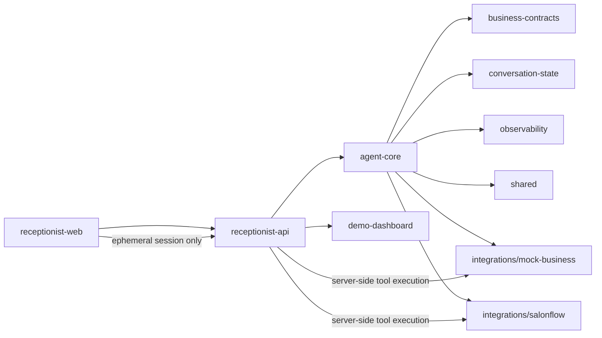

# Architecture

## Principles

- The core agent depends only on the adapter contract.
- SalonFlow is an integration, not a framework dependency.
- Tool execution happens on the server.
- Voice sessions are ephemeral and mediated by the backend.
- Stable business metadata is cached; appointment availability is not cached beyond a very short safe window.

